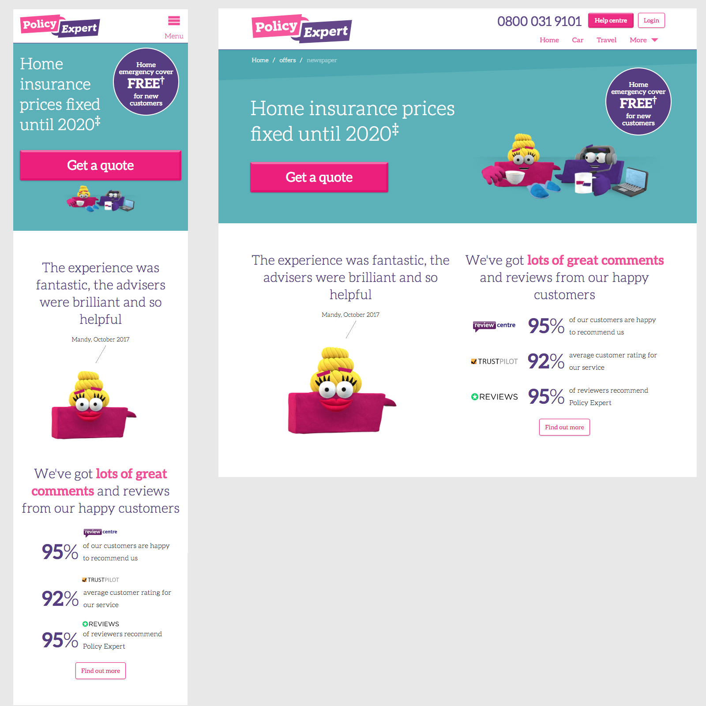

# Responsive web page
Using Bootstrap CSS, please recreate the attached: 'job_task_1.jpg' image below as a responsive HTML web page with two breakpoints, mobile and tablet:

## Resources
Fonts and images are stored in **/resources**

## Brand
### Fonts
Our font family is **Aleo.** Font files are in the **resources/fonts** folder.

- Aleo Regular
- Aleo Bold
- Aleo Light

### Colours
- purple: #563d82
- pink: #f04e98
- button pink: #ec1f7d
- green: #5cb1b9
- green dark: #4ca7b0
